# SleepQ Feedback - 2026-06-16

Source: `/Users/sashamusic/Downloads/sleepq comments 6.16.docx`

This file converts the Word document into a readable implementation reference and keeps the screenshots inline with the comments they support.

## Summary

### Form and inline-warning changes

- BMI: remove the first-page warning labels. If easy, show the BMI value and BMI definition ranges instead of labeling the patient.
- If BMI is below 18, add a report note under psychiatric or health diagnoses: "Your low BMI is suggestive of your being underweight. While difficult to discuss, we strongly recommend that you talk to your doctor about low BMI and symptoms of eating disorders."
- Change "I have bad dreams but not nightmares" to remove "but not nightmares."
- Nest bad-dream and nightmare questions under "I remember my dreams."
- Add a sleep-disordered-breathing warning when both mouth breathing and dry mouth are endorsed.
- Automatically change likely 12-6 bedtime entries to AM to prevent false PM responses.
- Increase nocturnal leg cramps threshold to 3 nights per week.
- Add a "3 or more nights a week" qualifier for supplement and prescription-medication questions.
- Set caffeine time default to AM, not PM.
- Change exercise warning language to "vigorous exercise for more than 45 minutes within 2 hours of bedtime."
- Add a general health statement if cigarette or nicotine use is endorsed.
- Add an excessive caffeine warning when caffeine use is greater than 4 servings per day.
- Add "you exercise less than three times a week" as a sleep hygiene issue.

### Algorithm and report changes

- COMISA is over-triggering. In the annotated case, EDS is acceptable but COMISA is not; the person should meet criteria for sleep apnea symptoms only, not insomnia plus apnea.
- Chronic fatigue/fibromyalgia is over-triggering and should have a higher threshold.
- Medication-related sleep disturbance should not be listed when the patient is only taking melatonin.
- RLS is appropriate in the annotated case, but nocturnal leg cramps is not.
- Avoid DSPD false positives.
- If sleep-disordered breathing and narcolepsy/EDS are both present, add a note that SDB/OSA can co-occur with disorders of excessive daytime sleepiness, often because overweight is common in EDS populations.
- If narcolepsy is probable and ADHD or depression is endorsed, add copy explaining that hypersomnia disorders are commonly misdiagnosed as depression or ADHD.
- If DSPD is likely, either suppress insomnia output or present insomnia symptoms as likely due to a circadian rhythm disorder.
- Similar precedence should apply for RLS: insomnia symptoms can be attributed to probable RLS when RLS is the likely driver.
- For insufficient sleep with daytime sleepiness, report copy should say EDS symptoms are likely due to insufficient sleep and/or other sleep disorders.

## Screenshot Reference

### BMI Classification

Clinician comment: cut the first-page warning/labeling. Prefer showing a BMI value and definition ranges. Add a low-BMI report warning when BMI is below 18.

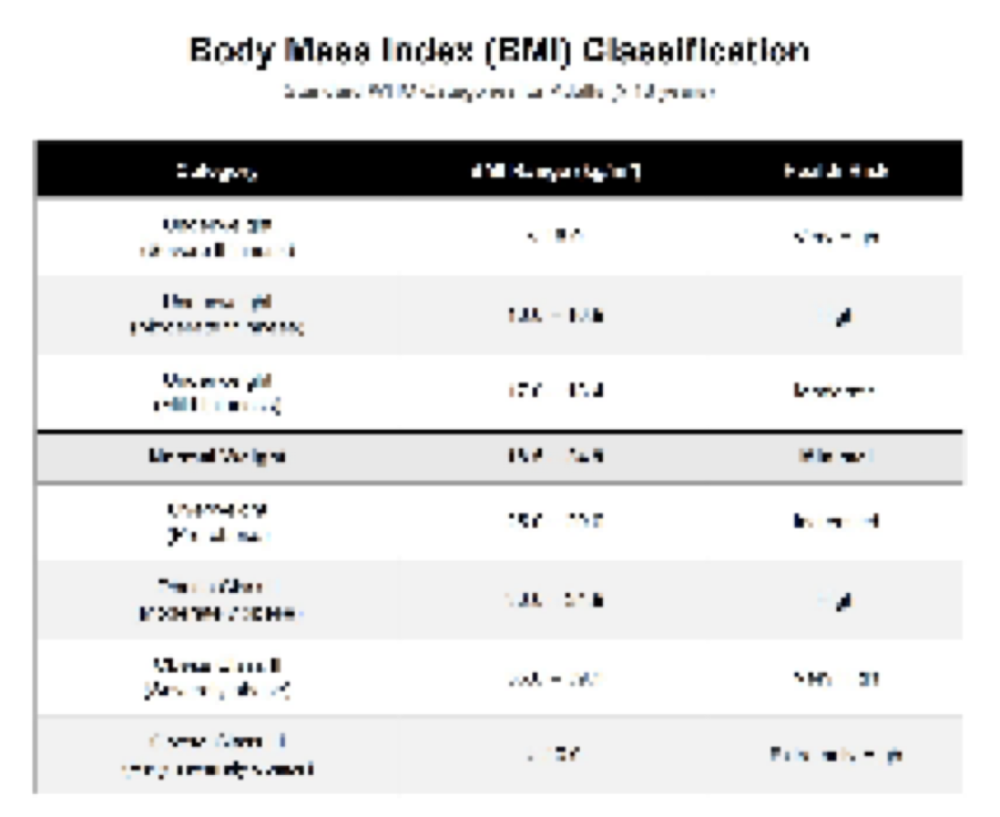

### Dreams And Nightmares

Clinician comment: change "I have bad dreams, but not nightmares" to "I have bad dreams." Bad-dream and nightmare questions should only show when the patient affirms dream recall.

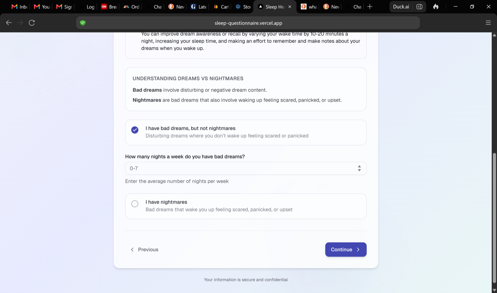

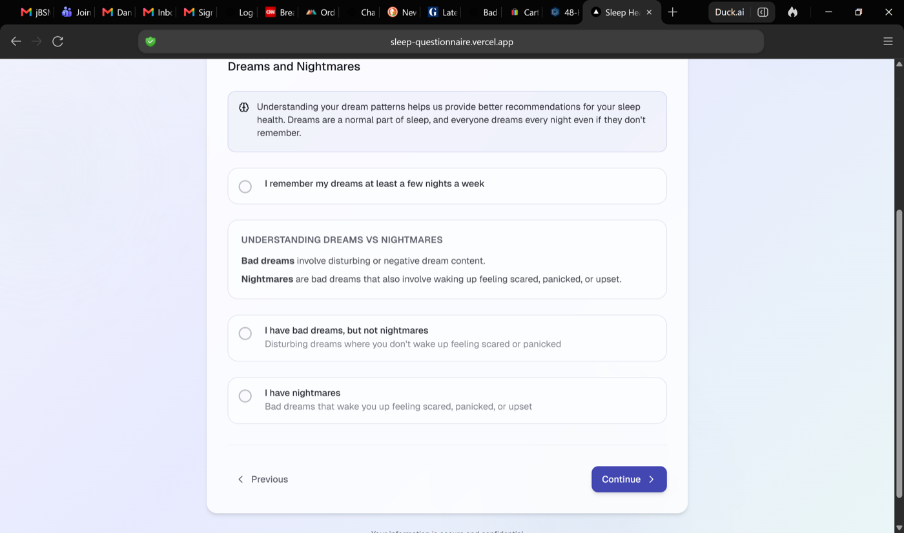

### Sleep-Related Breathing

Clinician comment: add a sleep-disordered-breathing warning when both mouth breathing and dry mouth are endorsed, even without snoring or observed apneas.

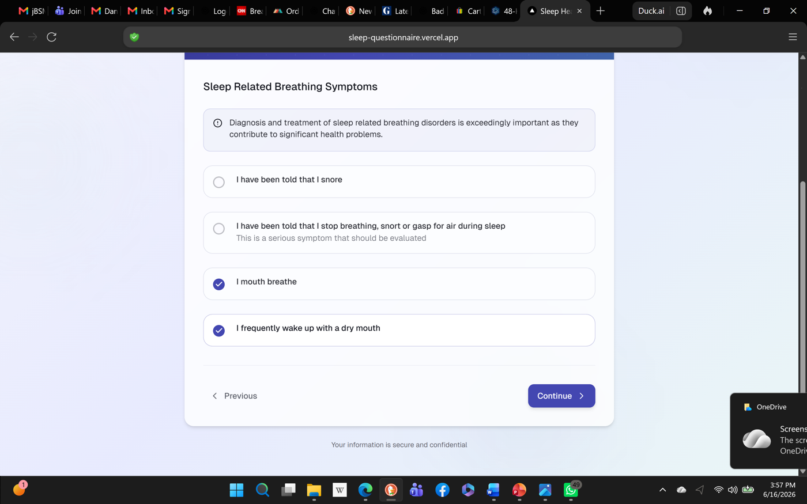

### Bedtime AM/PM

Clinician comment: to prevent false responses, automatically change to AM when someone enters a 12-6 bedtime.

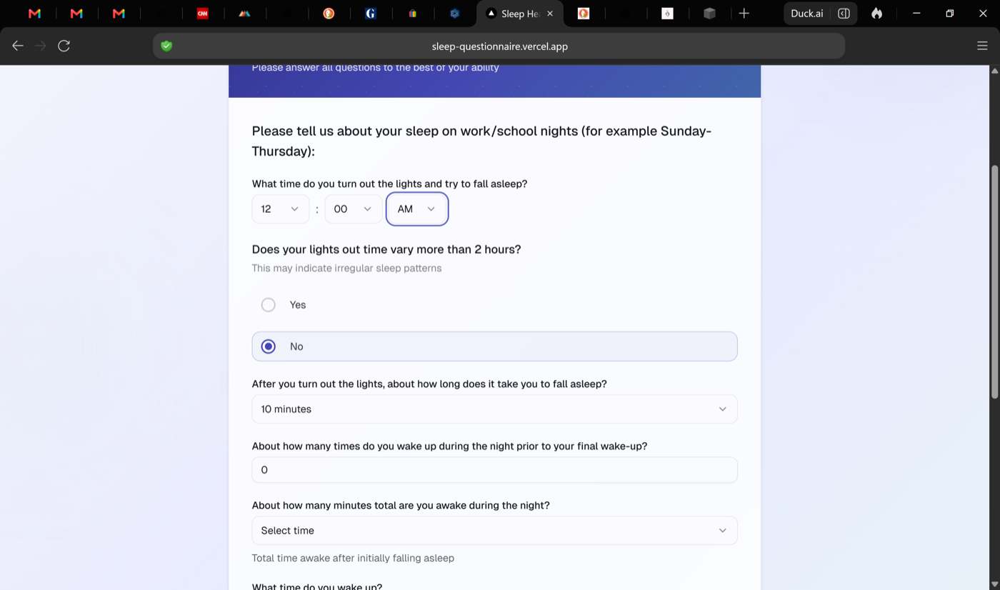

### Restless Legs And Leg Cramps

Clinician comment: raise nocturnal leg cramps threshold from 2 to 3 nights per week.

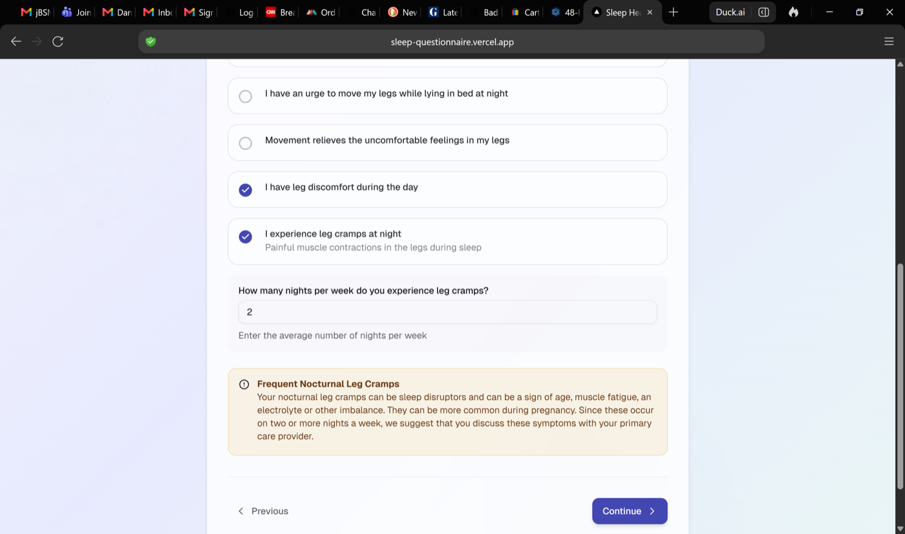

### Sleep Medications And Supplements

Clinician comment: add "3 or more nights a week" for supplement and prescription questions.

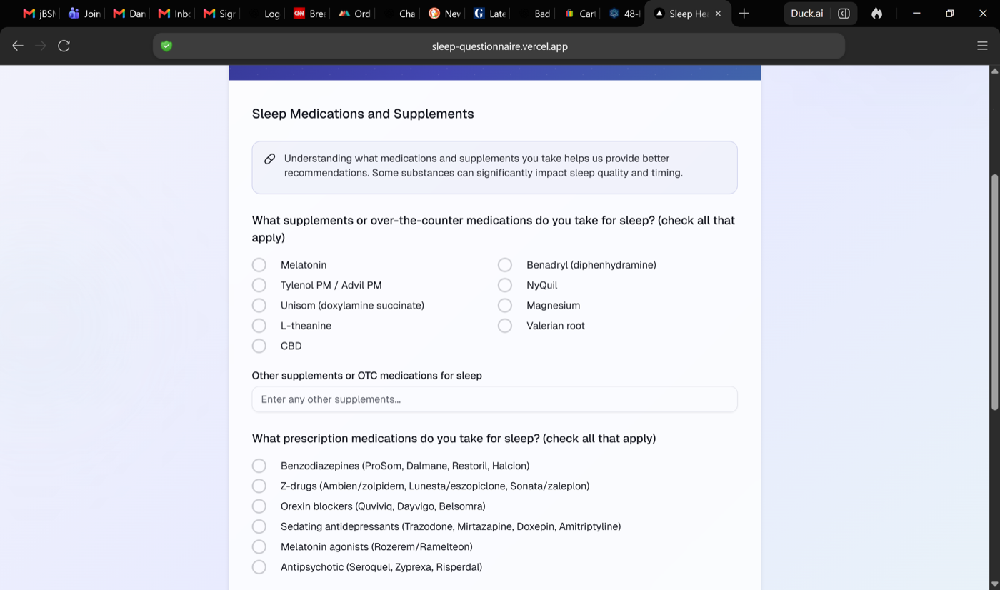

### Lifestyle: Caffeine

Clinician comment: caffeine time default should be AM.

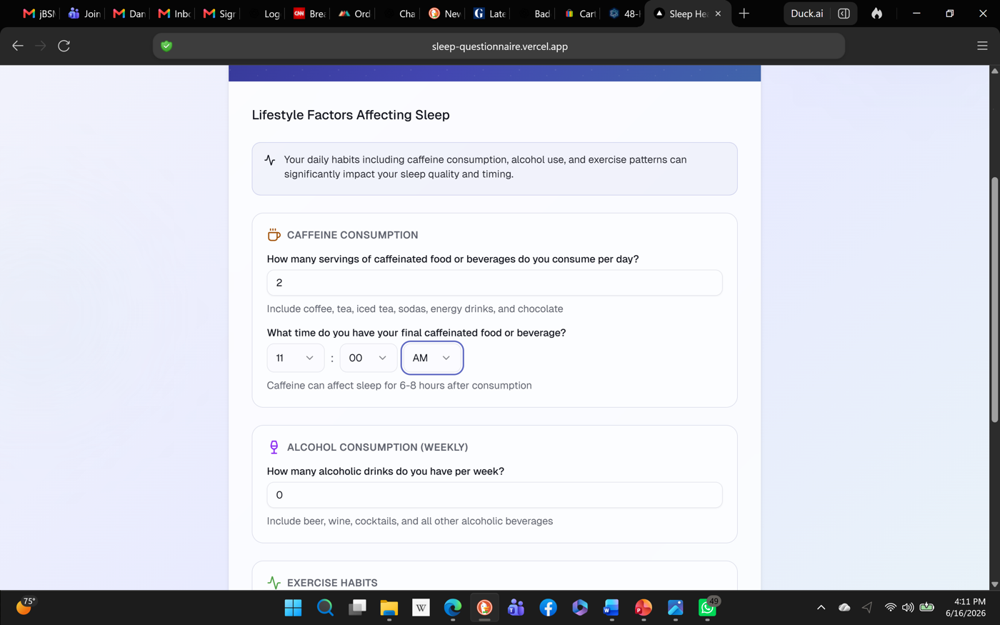

Clinician comment: add excessive caffeine warning when caffeine use is greater than 4 servings per day.

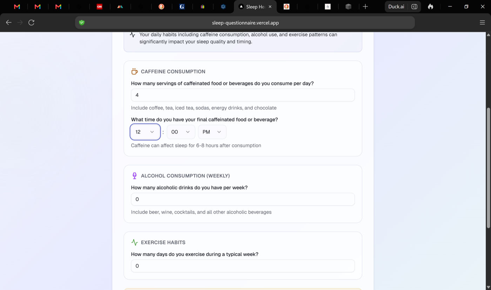

### Lifestyle: Exercise

Clinician comment: change warning verbiage to "vigorous exercise for more than 45 minutes within 2 hours of bedtime."

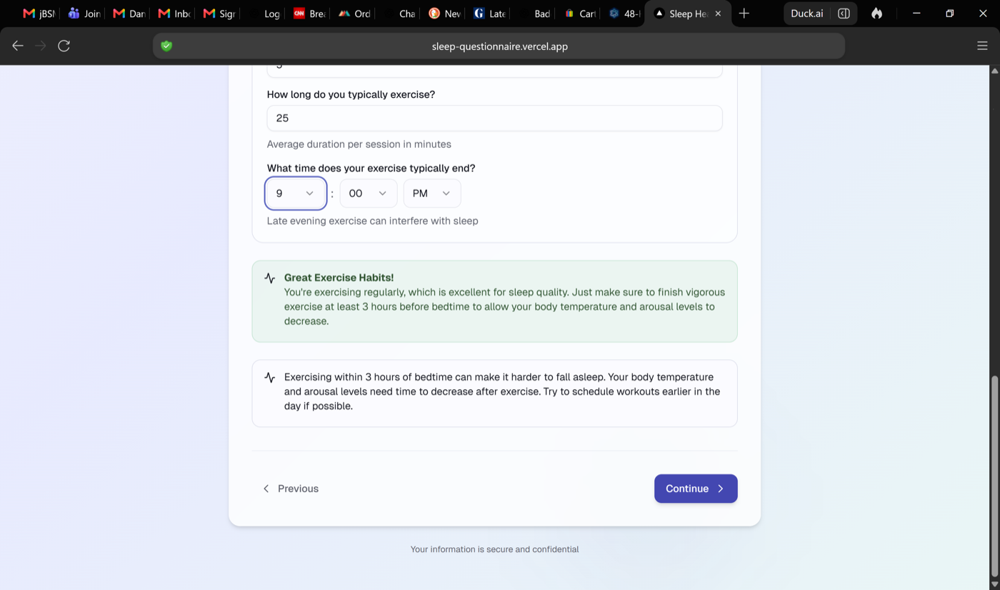

### Report Case 1: EDS Plus Sleep-Disordered Breathing

Clinician comment: EDS is okay. COMISA is not. This person should meet criteria for insomnia symptoms only when objective insomnia is present; here the report should identify sleep apnea/sleep-disordered breathing, not COMISA. Chronic fatigue is a false positive. Medication-related sleep disturbance is a false positive if only melatonin is used. RLS is okay, but nocturnal leg cramps should not appear.

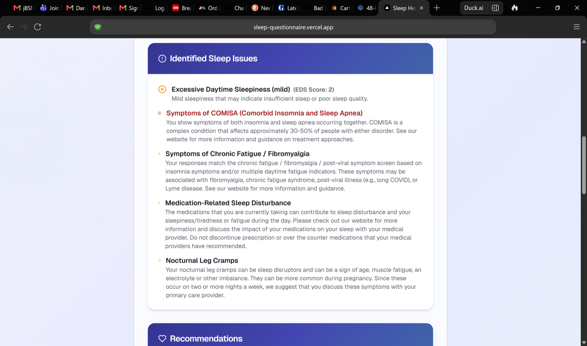

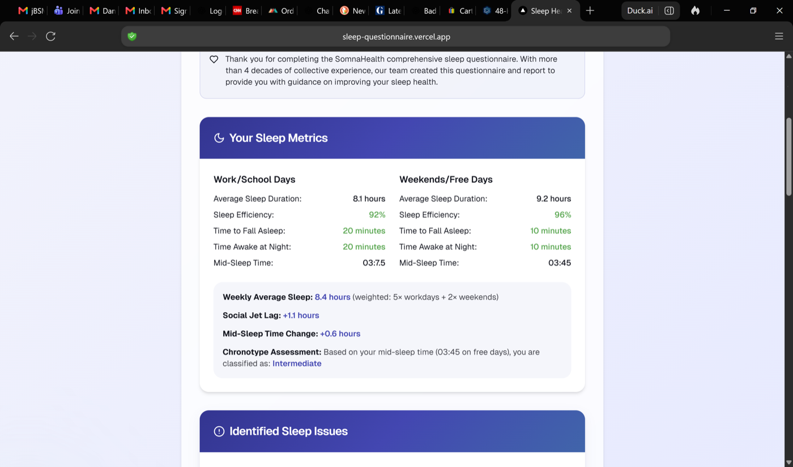

### Chronotype Popup

Clinician comment: the popup is on target, but cut assessment recommendations from the popup and leave those for the report and website.

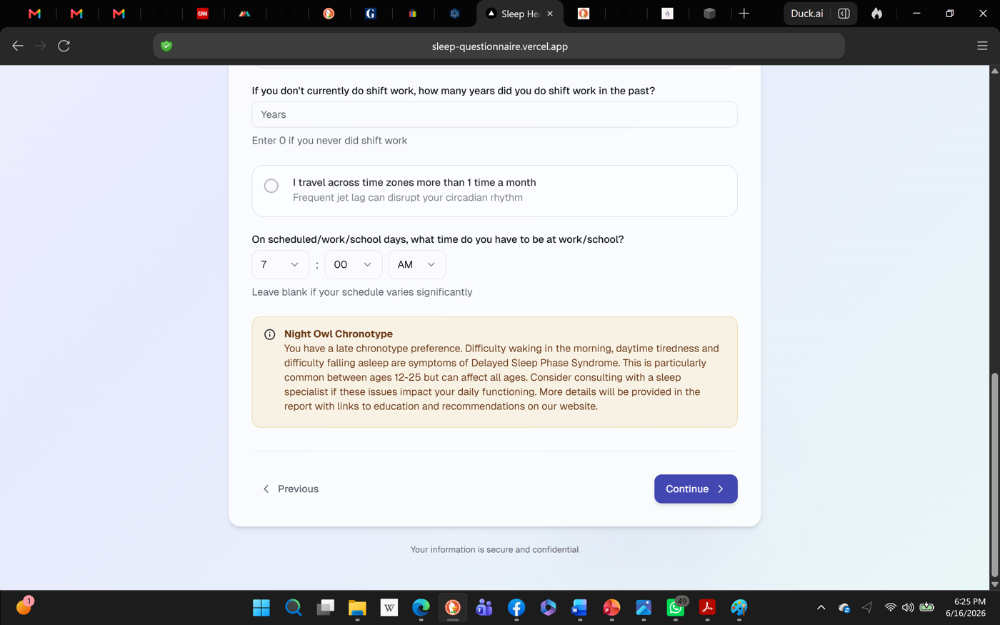

### Report Case 2: Delayed Sleep Phase

Clinician comment: this delayed sleep phase identification is correct. However, the insomnia output is a false positive; if DSPD is likely, insomnia should be suppressed or framed as likely due to a circadian rhythm disorder. Similar attribution applies when RLS is present.

Requested sleep metrics wording:

- Social Jet Lag: catching up more than 1.5 hours on weekends suggests insufficient sleep during the week or a circadian rhythm disorder.
- Mid-Sleep Time Change: sleeping later on weekends suggests catch-up sleep and a propensity for a later chronotype and a possible circadian rhythm disorder.

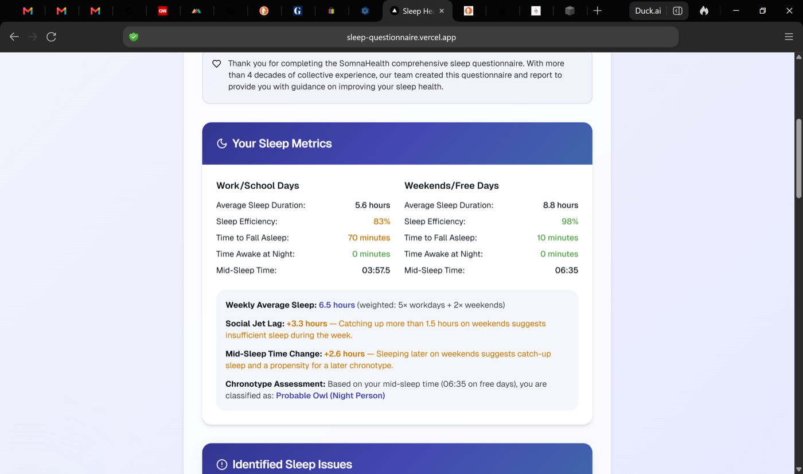

### Report Case 3: Insufficient Sleep

Clinician comment: diagnosis is accurate. The comorbid possible delayed sleep phase finding is acceptable here.

Requested wording:

- Mid-Sleep Time Change: sleeping later on weekends suggests catch-up sleep and a propensity for a later chronotype and insufficient nightly sleep.

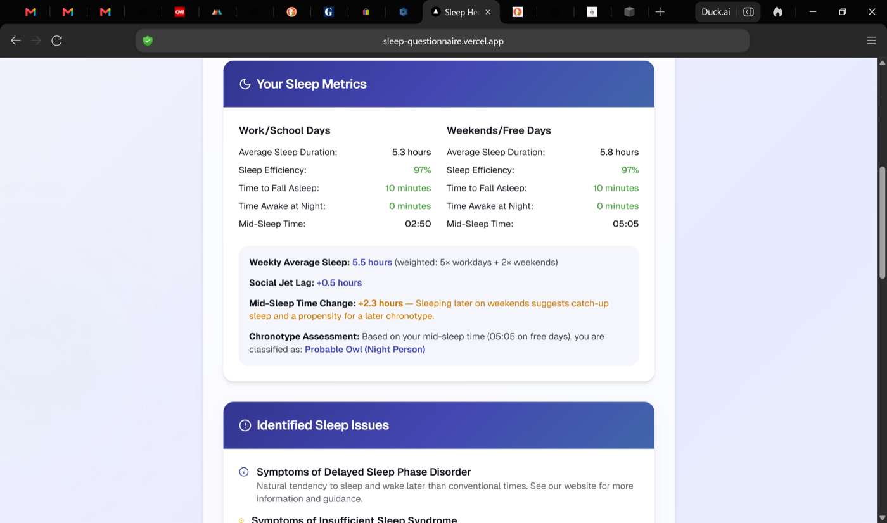

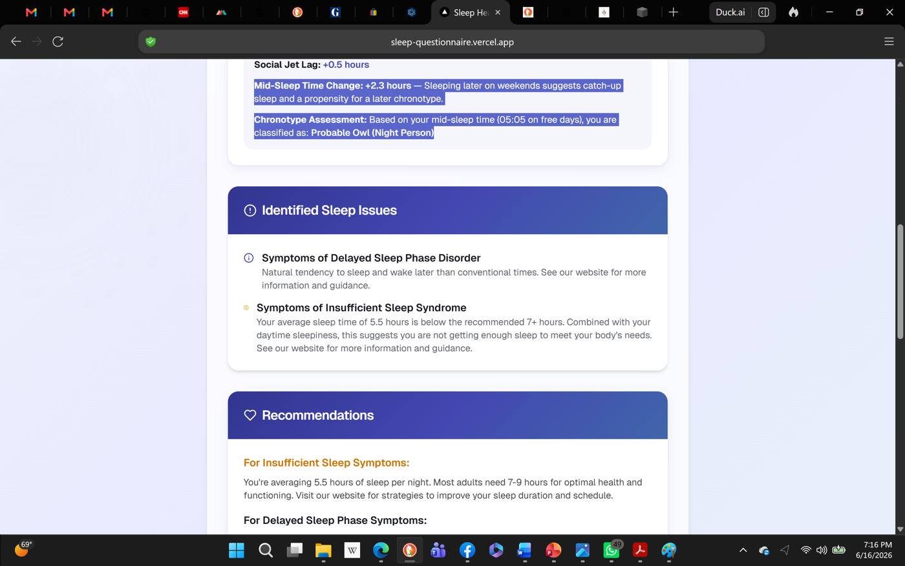

## Report Copy Notes

Use the following clinician-provided copy direction while editing web and PDF report output.

### Insomnia

Based on your responses, we recommend exploring treatment options for insomnia. Insomnia is a common sleep disorder that involves difficulty falling asleep, staying asleep, or poor sleep quality that is associated with daytime impairment. The most effective treatment for insomnia is Cognitive Behavior Therapy for Insomnia. Please visit our website for detailed information on Cognitive Behavioral Therapy for Insomnia (CBT-I) and other strategies.

### COMISA

Your symptoms suggest COMISA (Comorbid Insomnia and Sleep Apnea), which means that you have symptoms of both insomnia and sleep-disordered breathing, which in its more severe form is called obstructive sleep apnea syndrome. COMISA requires coordinated treatment of both conditions. You can also tell your primary care doctor or a sleep doctor that you are concerned that you have signs of sleep-disordered breathing and want to know options for assessment and diagnosis. Visit our website for detailed information on comprehensive evaluation and treatment approaches for both of these disorders.

### Chronic Fatigue / Fibromyalgia

Chronic fatigue syndrome and fibromyalgia are difficult to diagnose disorders that involve a combination of non-restorative sleep, pain, and fatigue. Visit our website for detailed information on evaluation options and management strategies. You might also want to raise this as a possible diagnosis with your primary care doctor and ask for a referral to a sleep specialist, neurologist, or rheumatologist.

### Medication-Related Sleep Disturbance

Your medications may be contributing to your sleep difficulties. Visit our website for more information and discuss the impact of your medications on your sleep with your primary care provider. Please do not discontinue any medications without consulting your prescribing provider.

### General Sleep Hygiene

Good sleep hygiene is foundational to healthy sleep. Based on your answers, there are several sleep hygiene improvements you may want to focus on, including changes in your bedroom to support sleep, establishing a bedtime ritual, discontinuing eating more than 2 hours before getting into bed, discontinuing rigorous exercise more than 1.5 hours before getting into bed, establishing a regular bedtime that varies no more than 30 minutes on weeknights and one hour between weeknights and weekend or unscheduled nights, eliminating caffeine at least 10 hours before bedtime, and decreasing naps to no more than 20 minutes a day. Visit our website for comprehensive information on adjusting your sleep hygiene to improve your sleep health and sleep quality.

### SomnaHealth Services

Our team offers sleep education that addresses the specific problems identified in this report. We also have sleep coaches and a board-certified sleep doctor who can support you with evidence-based treatments including CBT-I and consultation regarding the best treatment approaches. Visit our website for more information about how we can help you achieve better sleep. You can also find board-certified sleep specialists near where you live.
