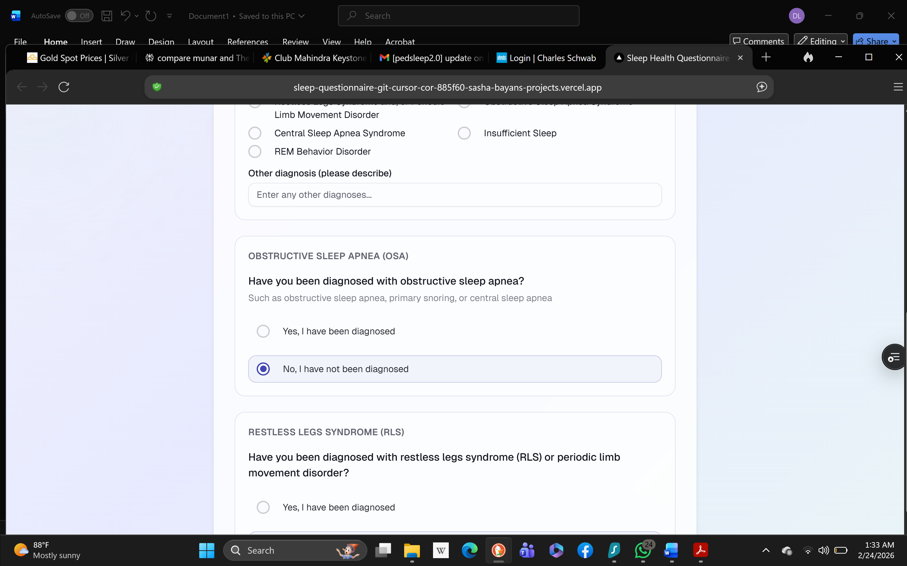
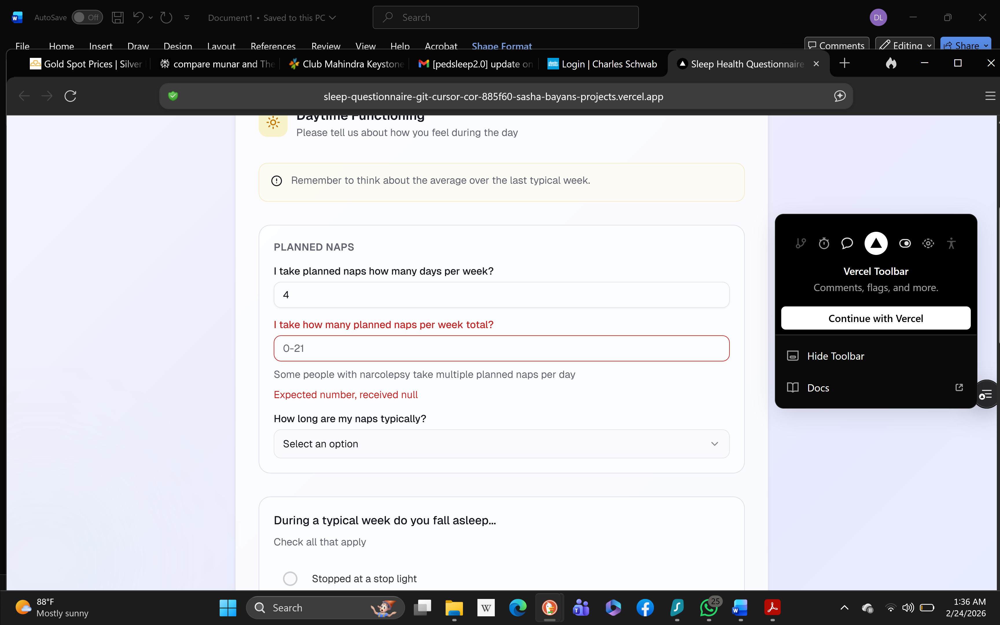
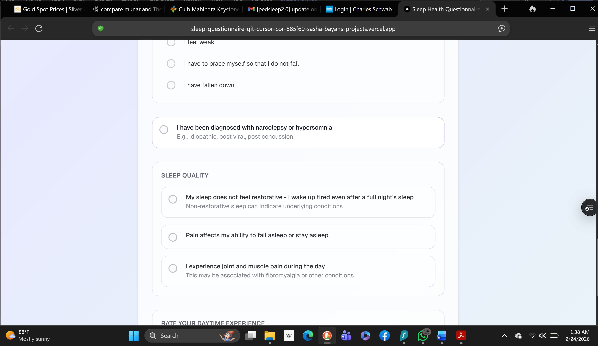
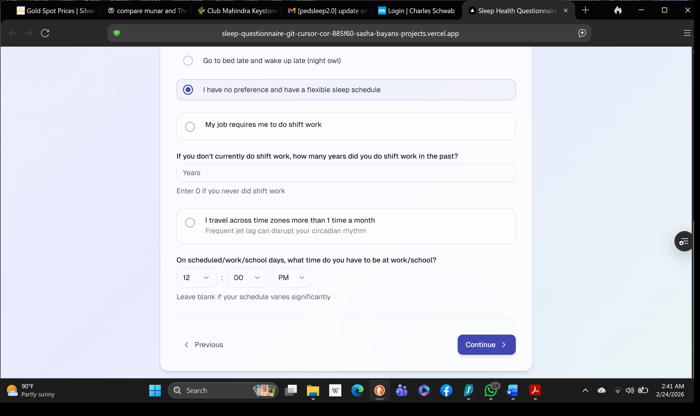
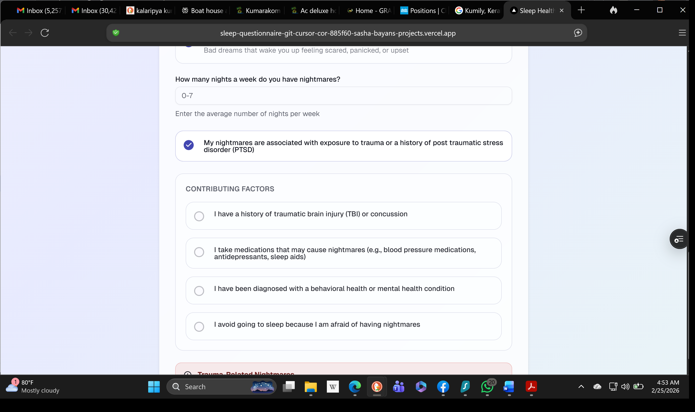

# Additional Comments - DL 2.28.2026

## Feedback Items

### 1. Birth Year Range
Youngest respondent would be 12. Please change birth year range -- 2014.

### 2. Cut Redundant OSA/RLS Questions
Cut additional question regarding sleep apnea and restless legs syndrome. These are redundant with above.

### 3. Cut Second Planned Nap Question
Cut second planned nap question.

### 4. Zero-Minute Option
Add a 0 minute option to time to fall asleep on weekday and weekends.

### 5. Scrolling Issue
Having trouble scrolling down beyond 10:00.

### 6. Cut Redundant Narcolepsy Question
Cut redundant narcolepsy question.

### 7. Bedtime/Wake Time AM/PM Defaults & Validation
Is it possible to add an error detector if bedtimes and wake times on weekdays and weekends are not in logical zone? I can provide these. People get mixed up with am and pm! And maybe leave default bedtime as PM and default wake time as AM for both weekday and weekends.

### 8. Conditional Work Schedule Question
Please make this question a pop-up if prior was affirmative. Also make schedule start time AM default.

### 9. Cut Redundant Parasomnia Diagnosis
Cut, I have been diagnosed with a parasomnia - p. 9 redundant.

### 10. Cut Nightmare Contributing Factors
Cut questions below and add number of nightmares/week....and suggest nightmare disorder in report if two or more times/week.

### 11. Report Text Updates

**Room for Improvement** (Bedroom)
> We provide several recommendations to improve your sleep by improving the comfort of your bedroom.
(Remove bullet list: declutter, mattress, blackout curtains, earplugs)

**Sleep-Related Anxiety Detected**
> It's likely that anxiety and worry are interfering with your ability to surrender to sleep at night. This creates a vicious cycle where worry about sleep prevents sleep, which increases worry. In your personalized report we will provide links to our website for information on treatment options.

**Sleep Effort Paradox**
> The harder you try to sleep, the more elusive it becomes. Sleep is a passive process that cannot be forced. We will provide you with some free tips to fall asleep with ease.

**Mental Health Resources**
> If you're experiencing anxiety, depression, or other mental health concerns that affect your sleep, remember that help is available. Mental health professionals can provide evidence-based treatments that address both sleep and emotional well-being. Don't hesitate to reach out for support when needed. We will provide link to more information in your personalized report.

**Next Steps - Mental Health Support Available**
> Your nightmares may be related to trauma and you endorsed symptoms of anxiety. Trauma-related nightmares improve specialized therapy. Visit our website for resources on finding appropriate mental health support for nightmares and other mental health challenges.

**Resources - SomnaHealth Services**
> Our team offers sleep education that addresses the specific problems that we have identified in this report. We also have a staff of sleep coaches and board certified sleep doctor who can support you with evidence based treatments including CBT-I and consultation regarding the best treatment approaches. Visit our website for more information about how we can help you achieve better sleep. You can also find board certified sleep specialists near where you live. On our website we provide you with links to help you find a sleep specialist or other health care professional.

**Significant Sleep Impact on Daily Life**
> Based on your answers, your sleep difficulties are significantly impacting your daily functioning. In your personalized sleep report we will provide you with a probable diagnosis and recommendations on next step to address your sleep problems.

### 12. Remove "personalized" from recommendations
Answered with symptoms of undiagnosed narcolepsy. Cut -- personalized -- in recommendations (we want the whole report to seem personalized). These should include recommendations for specific diagnoses.
